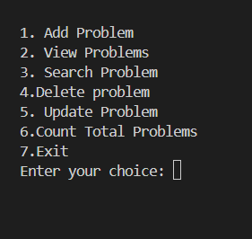
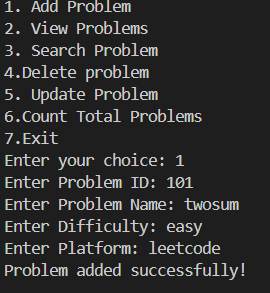
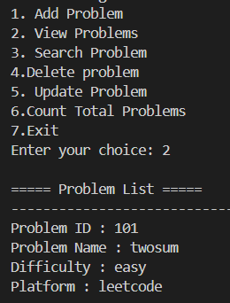
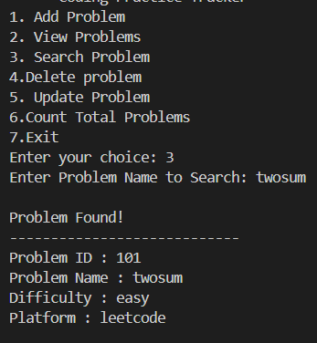
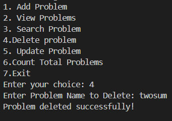
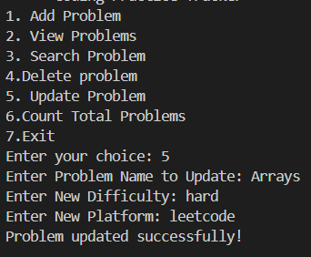
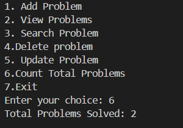

# Coding Practice Tracker

## 📌 About
Coding Practice Tracker is a Java console-based application that helps users keep track of coding problems they have solved.

## ✨ Features
- Add Problem
- View Problems
- Search Problem
- Delete Problem
- Update Problem
- Count Total Problems
- Exit

## 🛠 Technologies Used
- Java
- Object-Oriented Programming (OOP)
- ArrayList
- Scanner

## 📂 Project Structure
- Problem.java
- CodingPracticeTracker.java

## ▶️ How to Run
1. Open the project in VS Code.
2. Compile the Java files.
3. Run `CodingPracticeTracker.java`.
4. Use the menu to manage coding problems.
   
## Output

### Menu

### Add Problem

### View Problems

### Search Problem

### Delete Problem

### Update Problem

### Count Total Problems
   

## 🚀 Future Improvements
- Save problems to a file
- Load problems from a file
- Sort problems by difficulty
- Add user login

## 👩‍💻 Author
Bhupalam Sai Sowmya
